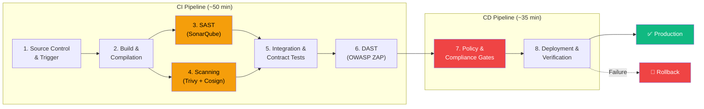

# Zero-Downtime CI/CD Pipeline

> **Author**: Nihal N  
> **Track**: DevOps & Cloud Engineer  
> **Category**: CI/CD Pipeline Architecture  
---

## Executive Summary

This project delivers a production-grade, eight-stage CI/CD pipeline architecture for **NovaPay Digital Bank** — a fictional RBI-licensed bank transforming from manual SSH deployments to automated, compliant, zero-downtime continuous delivery. The pipeline addresses NovaPay's critical challenges: a 4.5-hour MTTR, fortnightly deployment cycles, zero automated compliance scanning, and 17 outstanding RBI audit non-conformances.

The architecture implements security-by-default through automated SAST, DAST, dependency scanning, container signing, and OPA/Kyverno policy gates — all mapped to RBI Master Direction on IT Risk and PCI-DSS v4.0 requirements. Blue-green and canary deployment strategies with statistical canary analysis ensure zero-downtime releases, while the expand-contract database migration pattern handles 100M+ row financial tables without maintenance windows. Automated rollback triggers across three severity categories guarantee sub-60-second recovery for critical failures.

The pipeline targets **DORA Elite performance**: multiple deployments per day, <1-hour lead time for changes, <5% change failure rate, and <1-hour MTTR — reducing commit-to-production time to under two hours while achieving five-nines availability.

---

## Architecture Overview


---

## Table of Contents

### 📋 Documentation (Deliverables 1–8)

| # | Deliverable | Document | Description |
|---|-------------|----------|-------------|
| 1 | Pipeline Architecture | [architecture.md](docs/01-pipeline-architecture/architecture.md) | 8-stage pipeline with Mermaid diagrams, timing, and parallel execution |
| 2 | Deployment Strategies | [deployment-strategies.md](docs/02-deployment-strategies/deployment-strategies.md) | Blue-green + canary with statistical analysis and rollback |
| 3 | Compliance Gates | [compliance-gates.md](docs/03-compliance-gates/compliance-gates.md) | 6+ gates mapped to RBI IT Risk & PCI-DSS v4.0 |
| 4 | Database Migration | [database-migration.md](docs/04-database-migration/database-migration.md) | Zero-downtime expand-contract for 100M+ row tables |
| 5 | Environment Promotion | [environment-promotion.md](docs/05-environment-promotion/environment-promotion.md) | 4-environment model with promotion criteria and RBAC |
| 6 | Rollback Specification | [rollback-specification.md](docs/06-rollback-specification/rollback-specification.md) | 3-category automated rollback with trigger taxonomy |
| 7 | Runbook & Playbook | [ops-documentation.md](docs/07-runbook-playbook/ops-documentation.md) | Production runbook + incident response playbook |
| 8 | Observability | [observability.md](docs/08-observability/observability.md) | DORA metrics, 15+ pipeline metrics, dashboard designs |

### 🔧 Pipeline Stage Details

| Stage | Specification | Tool |
|-------|--------------|------|
| Stage 1: Source Control | [stage-1-source-control.md](docs/01-pipeline-architecture/stage-details/stage-1-source-control.md) | GitHub Enterprise |
| Stage 2: Build | [stage-2-build.md](docs/01-pipeline-architecture/stage-details/stage-2-build.md) | Gradle + Docker |
| Stage 3: SAST | [stage-3-sast.md](docs/01-pipeline-architecture/stage-details/stage-3-sast.md) | SonarQube 10.x |
| Stage 4: Scanning | [stage-4-scanning.md](docs/01-pipeline-architecture/stage-details/stage-4-scanning.md) | Trivy / Syft / Cosign |
| Stage 5: Integration | [stage-5-integration-testing.md](docs/01-pipeline-architecture/stage-details/stage-5-integration-testing.md) | Pact 5.x / Testcontainers |
| Stage 6: DAST | [stage-6-dast.md](docs/01-pipeline-architecture/stage-details/stage-6-dast.md) | OWASP ZAP 2.14+ |
| Stage 7: Compliance | [stage-7-compliance-gates.md](docs/01-pipeline-architecture/stage-details/stage-7-compliance-gates.md) | OPA / Kyverno / Cosign |
| Stage 8: Deployment | [stage-8-deployment.md](docs/01-pipeline-architecture/stage-details/stage-8-deployment.md) | ArgoCD 2.x / Istio |

### ⚙️ Pipeline Code

| Component | Path | Description |
|-----------|------|-------------|
| CI Pipeline | [ci-pipeline.yml](pipeline/.github/workflows/ci-pipeline.yml) | Full 8-stage GitHub Actions workflow |
| Reusable SAST | [reusable-sast.yml](pipeline/.github/workflows/reusable-sast.yml) | Shared SAST workflow for microservices |
| Reusable Scan | [reusable-container-scan.yml](pipeline/.github/workflows/reusable-container-scan.yml) | Shared container scanning workflow |
| Helm Chart | [novapay/](pipeline/helm/novapay/) | Kubernetes deployment chart with templates |
| Terraform IaC | [terraform/](pipeline/terraform/) | VPC, EKS, RDS infrastructure modules |
| OPA Policies | [opa/](pipeline/policies/opa/) | 4 Rego policies for K8s compliance |
| Kyverno Policies | [kyverno/](pipeline/policies/kyverno/) | 2 YAML policies for K8s admission |
| ArgoCD Manifest | [argocd-application.yaml](pipeline/argocd-application.yaml) | GitOps deployment configuration |
| Scripts | [scripts/](pipeline/scripts/) | Automation scripts (coverage, canary, rollback) |

### 📊 Dashboards

| Dashboard | Path | Purpose |
|-----------|------|---------|
| Engineering | [engineering-dashboard.json](dashboards/grafana/engineering-dashboard.json) | Real-time ops: DORA metrics, pipeline health |
| Management | [management-dashboard.json](dashboards/grafana/management-dashboard.json) | Weekly/monthly executive view |
| Regulatory | [regulatory-dashboard.json](dashboards/grafana/regulatory-dashboard.json) | Audit-ready compliance evidence |
| Wireframes | [dashboard-wireframes.md](dashboards/mockups/dashboard-wireframes.md) | Design specifications for all dashboards |

### 📖 Operational Documentation

| Document | Path | Purpose |
|----------|------|---------|
| Deployment Runbook | [deployment-runbook.md](runbooks/deployment-runbook.md) | Step-by-step production deployment (3 AM standard) |
| Incident Playbook | [incident-playbook.md](runbooks/incident-playbook.md) | Severity-based incident response workflow |

### 📝 Evidence & Assessment

| Document | Path | Description |
|----------|------|-------------|
| Self-Assessment | [self-assessment.md](evidence/self-assessment.md) | Badge scores with justification |
| Reflections | [reflections.md](evidence/reflections.md) | 5 reflection questions (200-400 words each) |
| Incident Simulation | [incident-simulation.md](evidence/incident-simulation.md) | Friday 5 PM scenario response with timestamps |
| Post-Mortem | [post-mortem.md](evidence/post-mortem.md) | Post-mortem report from incident simulation |
| TRC Presentation | [trc-presentation.md](evidence/trc-presentation.md) | Technology Risk Committee presentation (20 slides) |
| ERRATA | [ERRATA.md](ERRATA.md) | 3 deliberate errors identified and corrected |

---

## Tools Used

| Category | Tool | Purpose |
|----------|------|---------|
| CI/CD Engine | GitHub Actions | Pipeline orchestration |
| GitOps | ArgoCD 2.x | Declarative Kubernetes deployments |
| IaC | Terraform 1.7+ | Cloud infrastructure provisioning |
| K8s Packaging | Helm 3.x | Application packaging and deployment |
| SAST | SonarQube 10.x | Static code analysis |
| DAST | OWASP ZAP 2.14+ | Dynamic security testing |
| Container Scanning | Trivy 0.50+ | Vulnerability and licence scanning |
| SBOM Generation | Syft | Software Bill of Materials |
| Image Signing | Cosign (Sigstore) | Supply chain security |
| Policy Engine | OPA / Kyverno | Kubernetes admission control |
| IaC Scanning | Checkov | Terraform security checks |
| Service Mesh | Istio | Traffic management, mTLS, canary routing |
| Metrics | Prometheus | Metrics collection |
| Dashboards | Grafana | Visualisation and alerting |
| Logs | Grafana Loki | Log aggregation |
| Tracing | OpenTelemetry / Jaeger | Distributed tracing |
| Diagrams | Mermaid / Draw.io | Architecture diagrams |

---

## Repository Structure

```
Project1A-DevOps&CloudEngineer-Malik-Rihan/
├── README.md                          # This file
├── ERRATA.md                          # 3 deliberate errors found & corrected
├── docs/
│   ├── 01-pipeline-architecture/      # Deliverable 1: 8-stage pipeline
│   │   ├── architecture.md
│   │   ├── diagrams/
│   │   └── stage-details/             # Per-stage specifications (8 files)
│   ├── 02-deployment-strategies/      # Deliverable 2: Blue-green + canary
│   ├── 03-compliance-gates/           # Deliverable 3: 6+ compliance gates
│   ├── 04-database-migration/         # Deliverable 4: ZDT migration
│   ├── 05-environment-promotion/      # Deliverable 5: 4-env promotion
│   ├── 06-rollback-specification/     # Deliverable 6: Automated rollback
│   ├── 07-runbook-playbook/           # Deliverable 7: Ops documentation
│   └── 08-observability/             # Deliverable 8: DORA + dashboards
├── pipeline/
│   ├── .github/workflows/             # GitHub Actions YAML (3 files)
│   ├── helm/novapay/                  # Helm chart with templates
│   ├── terraform/                     # VPC, EKS, RDS modules
│   ├── policies/                      # OPA Rego + Kyverno YAML
│   ├── scripts/                       # Automation scripts
│   └── argocd-application.yaml        # GitOps deployment config
├── dashboards/
│   ├── grafana/                       # 3 Grafana dashboard JSONs
│   └── mockups/                       # Dashboard wireframes
├── runbooks/
│   ├── deployment-runbook.md
│   └── incident-playbook.md
└── evidence/
    ├── self-assessment.md
    ├── reflections.md
    ├── incident-simulation.md
    ├── post-mortem.md
    ├── trc-presentation.md
    ├── screenshots/
    └── test-results/
```
---

<div align="center">

## 👨‍💻 Author

# Nihal N

### DevOps | Cloud | Kubernetes | AWS 

[](https://www.linkedin.com/in/nihal-n-cse/)

**If you found this repository useful, consider giving it a ⭐**

</div>

---
